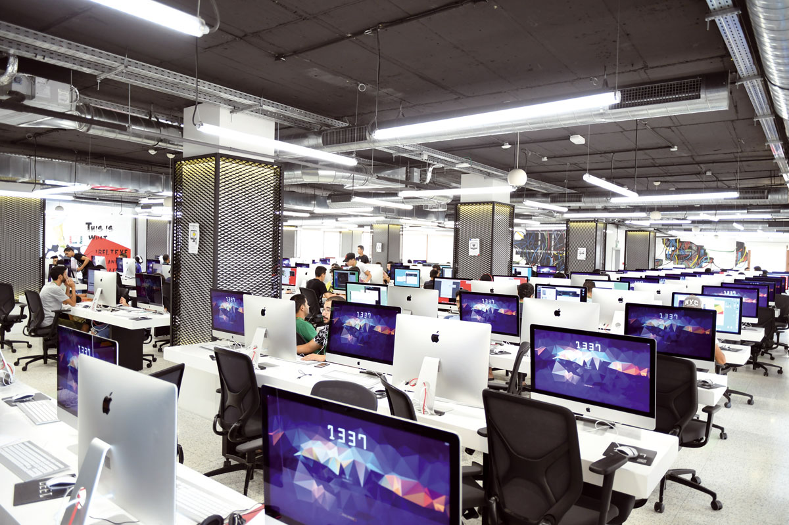

# 1337 Pool

1337 is a coding school with a focus on project-based and peer-to-peer learning.

## Technologies and Tools

In this pool, I've learned and used the following technologies:
- C programming language
- Shell scripting
- Linux/Command Line
- Git version control system
- Various libraries as required by projects

## Curriculum

The 1337 pool curriculum consists of various projects covering computer science and software engineering fundamentals, as well as more advanced topics such as algorithms and data structures. Each project will build upon the skills and knowledge you have acquired, allowing you to deepen your understanding of the subject matter.

## Learning Methodology

The 1337 pool follows a unique approach to education, where students are placed in a challenging and stimulating environment to learn through hands-on experience. The focus is on project-based learning, where students are given real-world problems to solve and must figure out the solution on their own. Peer-to-peer learning is also a crucial aspect of the program, where students work together to help each other grow and learn.

## Graduation Requirements

To graduate from the 1337 pool and get accepted to complete your study in 1337 school after the pool, students must successfully complete almost all the required projects and exams.

## Support and Community

The 1337 pool has a strong community of students, alumni, and staff who are always willing to help and support one another. Whether you need help with a project, or just want to chat about your experiences, there is always someone available to talk to.

I hope this README gives you a good overview of what the 1337 pool is all about. If you have any questions or would like to learn more, please contact me or visit the official [1337 website](https://www.1337.ma/).

< FUTURE: IS_LOADING />